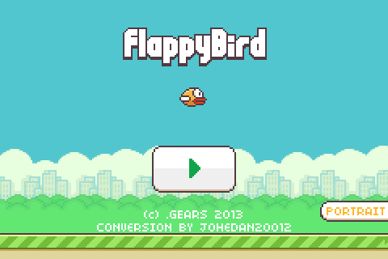
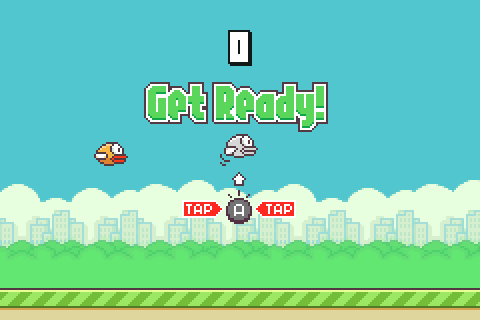

# Flappy Bird Advance

The classic mobile game comes to the Game Boy Advance (for the third time at least) this time implemented with the awesome C++ engine [Butano](https://github.com/GValiente/butano).

 

You can download the latest `.gba` file on the releases section or build it from the source code, and play it on GBA emulators like [mGBA](https://mgba.io/) or in real hardware using a FlashCart (set the save type to SRAM).

## How 2 play

Don't you know how to play? Well it's simple, press the `A` button to make the bird flap and avoid hitting the pipes or the ground. 

 

You win one point for each pair of pipes you pass, get a big score to obtain medals, glory and MORE!! (not really). 

In the title screen you can toggle between the landscape and portrait mode by using the `SELECT` button.

 

## Build

To build the project you first need to install the [Butano](https://github.com/GValiente/butano) engine and it's dependencies also verify you can build at least one of the examples that come with Butano.

Next, modify the path in `Makefile` that points to the directory where `butano.mak` is located,   i.e.
from `LIBBUTANO   :=  C://butano//butano` to your own path.

Now, on the root folder of the project run the command `make -j8` and the `.gba` file will be generated.

## Assets

* Sprites and backgrounds [LINK](https://www.spriters-resource.com/mobile/flappybird/sheet/59537/) 
* Sound effects [LINK](https://www.sounds-resource.com/mobile/flappybird/sound/5309/)

## License
Source code is licensed under MIT license, see the [LICENSE](LICENSE) file for details.

Licenses of Butano engine can be found in licenses folder